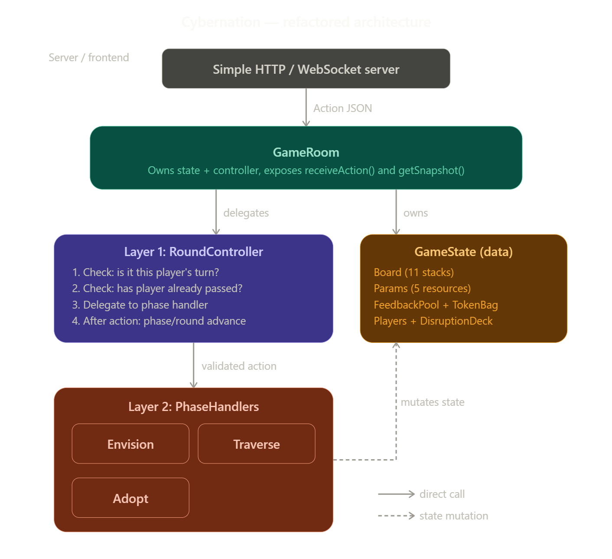

### Request Action JSON format

### `Envision Phase`

**1. Shift Power**
```json
{
    "phase": "ENVISION",
    "playerId": 0,
    "type": "shift_power",
    "params": {
        "targetPlayerId": 1
    }
}
```

**2. Come Together**
```json
{
    "phase": "ENVISION",
    "playerId": 0,
    "type": "come_together"
}
```

**3. Prepare**
```json
{
    "phase": "ENVISION",
    "playerId": 0,
    "type": "prepare"
}
```

**4. Set Course**
```json
{
    "phase": "ENVISION",
    "playerId": 0,
    "type": "set_course",
    "params": {
        "mode": "move_people",
        "tile": 3,
        "side": 4
    }
}

{
    "phase": "ENVISION",
    "playerId": 0,
    "type": "set_course",
    "params": {
        "mode": "rotate",
        "tile": 3,
        "degree": 2
    }
}

```

**5. Connect**
```json
{
    "phase": "ENVISION",
    "playerId": 0,
    "type": "connect",
    "params": {
        "cost": "HR",
        "gain": "Tech"
    }
}
```

**6. Steer**
```json
{
    "phase": "ENVISION",
    "playerId": 0,
    "type": "steer",
    "params": {
        "tokenType": "SOLVE_DISRUPTION"
    }
}
```

**7. Feedback track (not an action)**  
The server builds the token bag from the current board, shuffles, and fills 11 `adaptTrack` slots when Adapt first needs the track (e.g. before the first `resolve_feedback`). The client reads track state from `gameState` / snapshot; there is no `fill_track` request.

<br></br>

### `Traverse Phase`

**1. Walk People Token**
```json
{
    "phase": "TRAVERSE",
    "playerId": 0,
    "type": "walk_path"
}
```

**2. Draw Disruption Card**
```json
{
    "phase": "TRAVERSE",
    "playerId": 0,
    "type": "draw_disruption"
}
```

**3. Resolve Disruption Card**
```json
{
    "phase": "TRAVERSE",
    "playerId": 0,
    "type": "resolve_disruption",
    "params": {
        "cancel": "1",
        "canceltiles": "1,3,5",
        "effectIndex": "0,1,0",
        "targetTiles": "2,5",
        "useOptional": "1",
        "ppl": "3,4",
        "resourceDistribution": {
            "HR": "2",
            "Tech": "2",
            "Env": "1"
        },
        "trade": {
            "src": "HR",
            "dst": "Tech",
            "amount": "1"
        }
    }
}
```

**Fields for each disruption card Category**
```bash
CatA:              { "canceltiles": "1,3" }
CatB (none/res):   { "cancel": "1" }
CatB (stack):      { "canceltiles": "1,3" }
CatE:              { "cancel": "1" }
CatF:              { "HR": "2", "Tech": "2", "Env": "1" }
CatG:              { "effectIndex": "0,1,0" }
CatH:              { "effectIndex": "0", "ppl": "3,4" }
CatI:              { "targetTiles": "2,5" }
CatJ:              { "useOptional": "1" }
CatK:              { "src": "HR", "dst": "Tech", "amount": "1" }
```

<br></br>
### `Adapt Phase`

**1. Resolve feedback**
```json
{
    "phase": "ADOPT",
    "playerId": 0,
    "type": "resolve_feedback",
    "params": {
        "target_tile": "0",
        "decision": "allow"
    }
}
```

**2. Draw disruption**
```json
{
    "phase": "ADOPT",
    "playerId": 0,
    "type": "draw_disruption"
}
```

**3. Resolve disruption** (see Traverse Section 3 for `params` / Category fields; optional `disruption_name`, `times`, `decision` on same `type`)
```json
{
    "phase": "ADOPT",
    "playerId": 0,
    "type": "resolve_disruption",
    "params": {
        "cancel": "1",
        "canceltiles": "1,3,5",
        "effectIndex": "0,1,0",
        "targetTiles": "2,5",
        "useOptional": "1",
        "ppl": "3,4",
        "resourceDistribution": {
            "HR": "2",
            "Tech": "2",
            "Env": "1"
        },
        "trade": {
            "src": "HR",
            "dst": "Tech",
            "amount": "1"
        }
    }
}
```

**4. Cancel disruption**
```json
{
    "phase": "ADOPT",
    "playerId": 0,
    "type": "cancel_disruption"
}
```

<br></br>